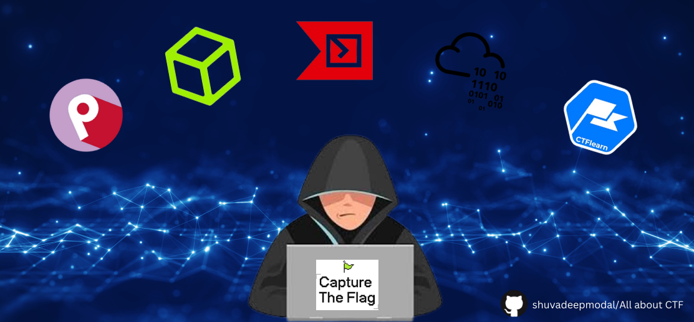

# CTF (Capture The Flags)

## Table of Contents

 - [Introduction ](#what-is-a-ctf) 
 - [Types](#types-of-ctfs) 
 - [ Prerequisite](#prerequisite-for-capture-the-flagctf-competitions) 
 - [Categories of CTF Challenges](#categories-of-ctf-challenges) 

## Available Resouces

Here is a list of the currently available categories of our resources:  
- [Cryptography](https://github.com/shuvadeepmondal/All-about-CTF/blob/main/Cryptography)
- [Web-Exploitation](https://github.com/shuvadeepmondal/All-about-CTF/blob/main/Web-Exploitation)
- [Forensics](https://github.com/shuvadeepmondal/All-about-CTF/blob/main/Forensics)

## What is a CTF?   
<pre>
Capture the Flag (CTF) is a type of cybersecurity competition where participants attempt to solve security-related challenges 
to find hidden flags (often strings of text) within files, networks, or systems. These flags serve as proof of solving a 
particular challenge. CTFs are a popular way for individuals to practice and demonstrate their skills in various aspects of 
cybersecurity.
</pre>

## Types of CTFs

CTF competitions generally fall into two main categories: Jeopardy-style and Attack-Defense. Additionally, there are specialized types of CTFs focused on specific skill sets or themes.

### 1. Jeopardy-style CTFs

In Jeopardy-style CTFs, participants or teams solve challenges from a board, similar to the game show "Jeopardy!" Challenges are categorized and usually vary in difficulty and point value. Categories can include:
<pre>
1. Reverse Engineering: Analyzing binary code to understand its functionality and find hidden information.
  
2. Forensics: Investigating digital artifacts such as disk images, memory dumps, and network capture to extract hidden data.
  
3. Cryptography: Solving puzzles related to encryption and decryption.
  
4. Web Exploitation: Finding vulnerabilities in web applications and exploiting them to retrieve flags.
  
5. Binary Exploitation: Identifying and exploiting vulnerabilities in compiled binaries.
  
6. Miscellaneous: Any other challenges that don't fit into the above categories, often creative or humorous in nature.
</pre>
### 2. Attack-Defense CTFs

In Attack-Defense CTFs, teams are provided with a vulnerable network or system, and the goal is to defend their own services while attacking the services of other teams. This type of CTF simulates real-world cybersecurity scenarios and typically includes the following elements:
<pre>
1. Service Defense: Keeping your own services running and secure against attacks.
  
2. Service Attack: Exploiting vulnerabilities in other teams' services to capture flags.
  
3. Scoring: Points are awarded for both successful defenses and attacks.
</pre>
### 3. Mixed CTFs

Some CTF competitions combine elements of both Jeopardy-style and Attack-Defense formats. These mixed CTFs might start with a series of Jeopardy-style challenges to gain initial points or resources, followed by an Attack-Defense phase.

### 4. Thematic CTFs

Thematic CTFs focus on specific areas of cybersecurity or incorporate story-driven elements. Examples include:
<pre>
1. Hardware CTFs: Challenges related to hardware hacking and embedded systems.
  
2. Social Engineering CTFs: Scenarios where participants must use social engineering tactics to obtain information or access.
  
3. Red vs. Blue CTFs: Teams are divided into attackers (Red Team) and defenders (Blue Team), with the Blue Team tasked with 
                      protecting a network from simulated attacks by the Red Team.
</pre>
### 5. Educational CTFs

These CTFs are designed for learning and may not be competitive. They often provide hints and learning resources, making them suitable for beginners or for training purposes.

## Prerequisite for Capture The Flag(CTF) Competitions

Here are the essential prerequisites to help you get started.
<pre>
1. Basics of Computer(Hardware , Software, Numeral Systems)

2. Basics of Operating System (Mainly Linux OS and Shell)
</pre>  
  [LinuxBasic Commands](https://blog.g0tmi1k.com/2011/08/basic-linux-privilege-escalation)
<pre>
3. Moderate Debugging Skills (Tools & Techniques)

4. Basics of the Networking (Models, Protocols, Tools)
</pre>
  [Networking Basics](https://www.cisco.com/c/en_in/solutions/small-business/resource-center/networking/networking-basics.html)
<pre>
5. Basics of the Computer Security (Cryptography, Web Securuty, Forensics)
   
6. Programming Language(Basic C/C++) and Python Scripting Language.
 
7. Basics Understanding of Cryptography (Encryption/Decryption).
 
8. Have a Knowledge of Binary, HexaDecimal, ASCII, Hexdump and Others Representation of Computer Data.
</pre>

## Categories of CTF Challenges
<pre>
1. Binary Explotation (PWN)
  
2. Reversing
  
3. Web
  
4. Forensic (Stegnography)
  
5. Miscellaneous
  
6. Operating System (Linux)
  
7. RecOn/Scripting
  
</pre>

[LiveOverFlow](https://www.youtube.com/watch?v=8ev9ZX9J45A)

### Binary Exploitation

Binary exploitation is the process of subverting a compiled application such that it violates some trust boundary in a way that is advantageous to you, the attacker. In this module, we are going to focus on memory corruption. By abusing vulnerabilities that corrupt memory in software, we can often rewrite critical application state information in a way that allows us to elevate privileges inside the context of a particular application (like a remote desktop server) or perform arbitrary computation by hijacking control flow and running code of our choosing.

 ***Follow Below Links for Binary Exploitation:***

| Name           | Link                                                                                          | Logo                                                |
|----------------|-----------------------------------------------------------------------------------------------|-----------------------------------------------------|
| LiveOverFlow   | [Watch on YouTube](https://www.youtube.com/watch?v=iyAyN3GFM7A&list=PLhixgUqwRTjxglIswKp9mpkfPNfHkzyeN) |        |
| GitHub         | [Trail of Bits](https://trailofbits.github.io/ctf/exploits/binary1.html)                     |         |
| RPISEC         | [RPISEC Courses](http://security.cs.rpi.edu/courses/binexp-spring2015/)                         |         |
| pwn            | [CTF101](https://ctf101.org/reverse-engineering/what-is-assembly-machine-code/#examples)        |        |
| micro          | [Microcorruption](https://microcorruption.com/login)                                           |  |

### Reversing

Reverse Engineering in a CTF is typically the process of taking a compiled (machine code, bytecode) program and converting it back into a more human-readable format. Very often, the goal of a reverse engineering challenge is to understand the functionality of a given program such that you can identify deeper issues.

**Follow Links for Binary Exploitation:**

| Name           | Link                                                                                          | Logo                                                |
|----------------|-----------------------------------------------------------------------------------------------|-----------------------------------------------------|
| LiveOverFlow   | [Watch on YouTube](https://www.youtube.com/watch?v=iyAyN3GFM7A&list=PLhixgUqwRTjxglIswKp9mpkfPNfHkzyeN) |        |
| GitHub         | [Trail of Bits](https://trailofbits.github.io/ctf/exploits/binary1.html)                     |         |
| RPISEC         | [RPISEC Courses](http://security.cs.rpi.edu/courses/binexp-spring2015/)                         |         |
| pwn            | [CTF101](https://ctf101.org/reverse-engineering/what-is-assembly-machine-code/#examples)        |        |
| micro          | [Microcorruption](https://microcorruption.com/login)                                           |  |

### Web

In Web Challenges, we exploit vulnerabilities in protocols or languages, like **PHP** and **XML**, or we take control over **HTTP** requests which are to/from the server. But it is very brief about CTF Web Challenges.

***Follow Below Links for More Information:***

| Name           | Link                                                                                          | Logo                                                |
|----------------|-----------------------------------------------------------------------------------------------|-----------------------------------------------------|
| WebLiveOverFlow| [Watch on YouTube](https://www.youtube.com/watch?v=jmgsgjPn1vs&list=PLhixgUqwRTjx2BmNF5-GddyqZcizwLLGP) |        |
| GitHub         | [Orangetw Challenges](https://github.com/orangetw/My-CTF-Web-Challenges)                      |         |
| Payloads       | [PayloadsAllTheThings](https://github.com/swisskyrepo/PayloadsAllTheThings/)                   |       |

### Forensic

Forensics is a broad CTF category that does not map well to any particular job role in the security industry, although some challenges model the kinds of tasks seen in Incident Response (IR). Even in IR work, computer forensics is usually the domain of law enforcement seeking evidentiary data and attribution, rather than the commercial incident responder who may just be interested in expelling an attacker and/or restoring system integrity.

**Follow Below Links for More Information:**

| Name           | Link                                                                                          | Logo                                                |
|----------------|-----------------------------------------------------------------------------------------------|-----------------------------------------------------|
| Forensic       | [Trail of Bits](https://trailofbits.github.io/ctf/forensics/)                                 |  |
| dog-stege      | [GitHub Write-ups](https://github.com/ctfs/write-ups-2014/tree/master/plaid-ctf-2014/doge-stege) |         |
| Hidden         | [CTFs Resources](https://ctfs.github.io/resources/topics/steganography/invisible-text/README.html) |  |

### Miscellaneous

Many challenges in CTFs will be completely random and unprecedented, requiring simple logic, knowledge, and patience to be solved. There is no sure-fire way to prepare for these, but as you complete more CTFs, you will be able to recognize and hopefully have more clues on how to solve them.

***Follow Below Links for More About Misc. Challenges:***

| Name           | Link                                                                                          | Logo                                                |
|----------------|-----------------------------------------------------------------------------------------------|-----------------------------------------------------|
| Misc           | [CTFs Resources](https://ctfs.github.io/resources/topics/miscellaneous/README.html)             |  |
| miSC           | [GitHub Write-ups](https://github.com/ctfs/write-ups-2014/tree/master/olympic-ctf-2014/crypting) |         |

### OS/Linux
<pre>
These challenges are about basic up to advanced level of **enumeration** of Operating Systems, mainly Linux and its Shell.
</pre>
### Cryptography

In the case of CTFs, the goal is usually to crack or clone cryptographic objects or algorithms to reach the flag.

***Follow Below Links for More Information about Crypto:***

| Name           | Link                                                                                          |
|----------------|-----------------------------------------------------------------------------------------------|
| Crypt          | [CTFs Resources](https://ctfs.github.io/resources/topics/cryptography/README.html)             |
| Cryptii        | [Cryptii](https://cryptii.com/)                                                               |
| Dec0de         | [dCode](https://www.dcode.fr/)                                                                |

### Recon/Scripting
<pre>
In these challenges, the flag is basically hidden on social media platforms. In scripting challenges, you have to write scripts
which automatically perform tasks.
</pre>

<pre><h3 align="center">Below Are Useful Links of Platforms For Beginners's CTF Challenges Practice</h3></pre>

1. [HackThisSite](https://hackthissite.org/)
2. [Overthewire](http://overthewire.org/wargames/)
3. [HackTheBox](https://www.hackthebox.eu/)
4. [VulnHub](https://www.vulnhub.com/)
5. [PenTesterLab](https://pentesterlab.com/)
6. [HackThis](https://www.hackthis.co.uk/) 
7. [ShelterLabs](https://shellterlabs.com/pt/) 
8. [rOOtMe](https://www.root-me.org/) 
9. [Zenk](https://www.zenk-security.com/epreuves.php) 
10. [w3challs](https://w3challs.com/) 
11. [newbieContest](https://www.newbiecontest.org/) 
12. [picoCTF](https://picoctf.com/) 
13. [pwnable](https://pwnable.kr/play.php) 

<h1 align="center">Thanking For Watching !! AND Good Luck All Beginners for CTFs </h1><centre>

 ### Contributors 🤝

## License 🛡️

[LICENSE](https://github.com/shuvadeepmondal/All-about-CTF/blob/main/LICENSE) file for details.
 

##### If you find this repository useful, please consider giving it a ⭐️

